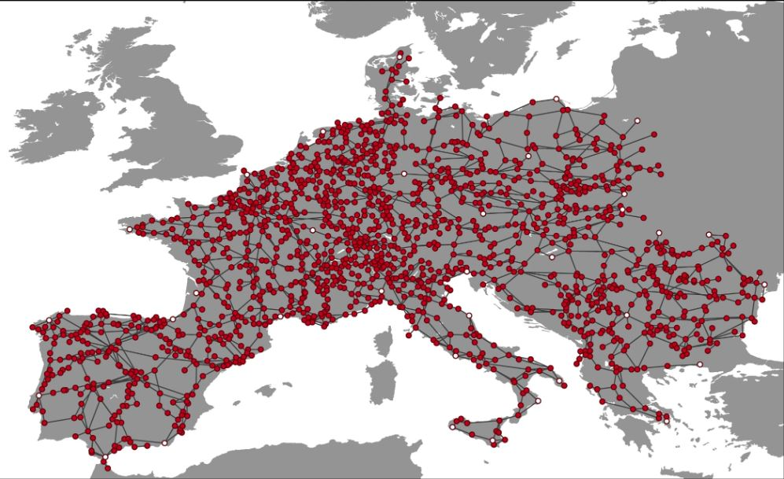
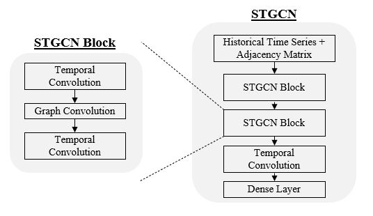
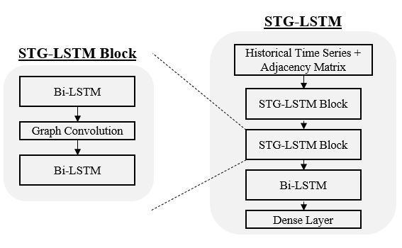
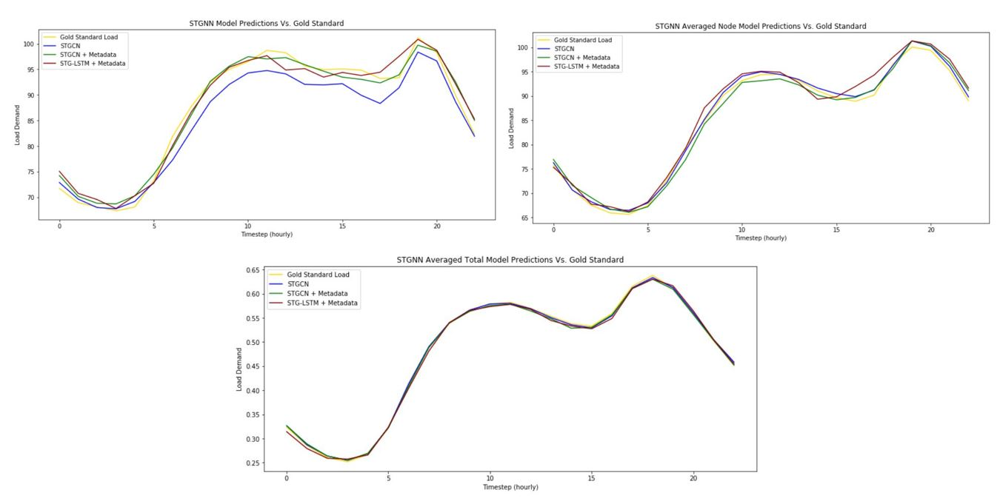

# An Exploration of Spatial Temporal Graph Neural Networks for Electricity Load Forecasting
## Austin Bell, Ziyin Wang, Malik Drabla 

For more details, please refer to our [paper](./report/An%20Exploration%20of%20STGNN%20for%20Electricity%20Load%20Forecasting.pdf)

./main.py - Implements STGNN for node level energy forcasting  
Running:   
```
python main.py [STGNN-config]
```
Where `[STGNN-config]` is the name of the config / arguments file in the ./configs folder    
./configs - Configuration files for main.py args   
./DGL.ipynb - Implementation of GCN with DGL 
./data - Model training data  
./savedModels - Model checkpoints and training/testing statisitics
./evaluation - Evaluation scripts and statisitics
./dataPrep - One-off notebooks for dataset cleaning and merging. Prior to implementing STGNN's cleaning notebooks must be run to generate processed data. 

## DataSet:
* [RE-Europe](https://www.nature.com/articles/sdata2017175)
* Includes 1,496 node buses across mainland europe with 2,156 transmission lines.



## Description:
GNNs and Benchmarks for Node-level Energy Load Forecasting.  
 * Implementation of STGNN variants using [pytorch](https://pytorch.org/)
 * Four implementations of STGNNs are included: STGCN, STGCN + Metadata, STG-LSTM, STG-LSTM + Metadata
 
#### STGCN
Originally implemented by [Yu et al (2018)](https://arxiv.org/pdf/1709.04875.pdf) for traffic load forecasting, STGCNs consist of two STGCN blocks, a final temporal convolution, and a final linear layer.



### STG-LSTM
A STGCN with temporal convolutions replaced by averaged Bi-LSTM layers. Attention Layers showed little to no improvement. 



### Metadata
Base models only utilize historical load and solar data for energy demand forecasting. Metadata such as holidays, average historical load, and average historical load variance are included to improve forecasting. 


## Results
Our STGCN-Metadata model performed best. 


The figures below compare the STGNN prediction results on the first node across varying levels of granularity. The top left figure displays the prediction for the first node and the first 24-hour prediction (October 2nd, 2014 00:00-23:00) for load demand. The top right figure displays the averaged predictions for the first node across the entire validation time period. The bottom figure displays the averaged predictions across all time-periods and across all nodes.

